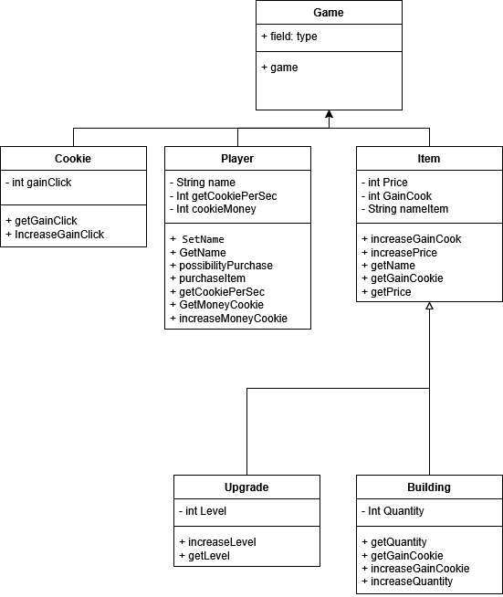

# Cookie Clicker - Java Edition

## Description
Ce projet est une version simplifiée du jeu **Cookie Clicker**, développée en **Java 21** en appliquant les principes de la **programmation orientée objet (POO)**. Le jeu permet au joueur de cliquer pour gagner des cookies, d'acheter des améliorations et des bâtiments pour augmenter la production de cookies.

## Fonctionnalités
- Gestion d'un joueur avec un nom, un revenu de cookies par seconde et une monnaie en cookies.
- Système de clic permettant d'augmenter le nombre de cookies.
- Possibilité d'acheter des améliorations pour booster le gain de cookies.
- Implémentation de bâtiments qui génèrent des cookies passivement.
- Gestion des prix et des gains des objets.
- Interface d'apllication.

## Diagramme du projet


## Structure du projet
Le projet est organisé en plusieurs packages :

```
fr.ynov.cookieClicker
│── Main            #permet de te lancer le jeu
│── Game            # Permet d'avoir l'interface et le principe du jeu
│── Cookie          # Gère le clic et le gain de cookies
│── Item            # Contient les objets achetables (bâtiments et améliorations)
│   ├── Buildings   # Classe représentant un bâtiment générant des cookies
│   ├── UpgradeClick # Classe représentant une amélioration de clic
│── Player          # Gère les informations et les actions du joueur
```

### Classes principales

#### `Player`
- **Attributs :** `name`, `gainCookiePerSec`, `cookieMonney`
- **Méthodes :** `increaseCookieMoney()`, `possibilityPurchase()`, `purchaseItems()`...

#### `Cookie`
- **Attributs :** `gainClick`
- **Méthodes :** `IncreasegainClick()`, `getGainClick()`

#### `Item`
- **Attributs :** `price`, `GainCookie`, `nameItems`
- **Méthodes :** `IncreaseGainCookie()`, `IncreasePrice()`, `getPrice()`...

#### `Buildings` (hérite de `Item`)
- **Attributs :** `quantity`
- **Méthodes :** `IncreaseQuantity()`, `getQuantity()`, `IncreaseGainCookie()`...

#### `UpgradeClick` (hérite de `Item`)
- **Attributs :** `level`
- **Méthodes :** `IncreaseLevel()`, `getLevel()`

## Installation et exécution

### Prérequis
- **Java 21** installé
- Un IDE comme **IntelliJ IDEA** ou **Eclipse**

### Compilation et exécution
1. Clonez le dépôt :
   ```sh
   git clone https://github.com/ElMonarita/CookieClicker.git
   cd cookie-clicker-java
   ```
2. Compilez le projet :
   ```sh
   javac -d bin src/fr/ynov/cookieClicker/**/*.java
   ```
3. Exécutez la classe principale :
   ```sh
   java -cp bin fr.ynov.cookieClicker.Main
   ```

## Documentation
Générez la documentation Javadoc avec :
```sh
javadoc -d doc -sourcepath src -subpackages fr.ynov.cookieClicker
```
Puis ouvrez `doc/index.html` dans un navigateur.

## Améliorations futures
- Refaire le design du projet
- Mise en place d'un meilleur shop.
- Sauvegarde et chargement des progrès.
- Nouveaux bâtiments et améliorations.

## Auteur
**BORDES Rémy** - [GitHub](https://github.com/ElMonarita)

---

🚀 **Clique, achète, et deviens le maître des cookies ! 🍪**

